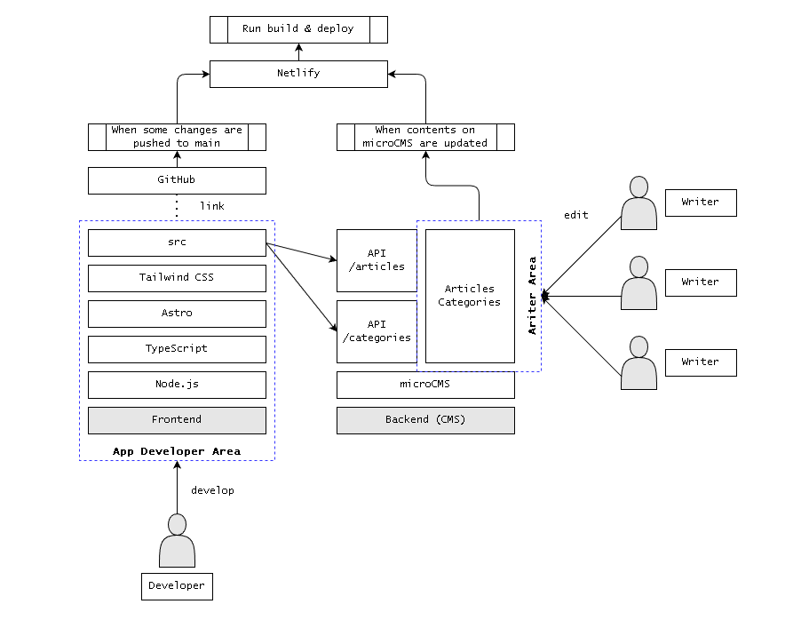

# chbaseball

"chbaseball" is the app repository of 中華人民共和国棒球維基.

## For wiki writers

All of resources at here are unrelated to write wiki contents.

## For wiki developers

Here are some info about "chbaseball" app.

### Wiki structure



- wiki app
  - this repository
    - Node.js
    - TypeScript
    - Astro
    - Tailwind CSS
- background (CMS)
  - microCMS
- CD
  - Netlify
- PaaS
  - Netlify

### App structure

```txt
public          <- put static resources (icon, robots.txt..)
  favicon.svg
src
  components    <- put component file (.astro)
    primitives  <- put atomic components
  layouts       <- put layout definition (.astro)
  pages         <- put page file (.astro)
  services      <- put service process (.ts)
  env.d.ts
.prettierrc
astro.config.mjs
package.json
tailwind.config.mjs
tsconfig.json
```

### Commands

- `npm run dev`
  - start local dev server
- `npm run build`
  - build astro resources to `dist`
- `npm run preview`
  - preview built archive locally
- `npm run astro`
  - run astro command like `astro add` `astro check`
